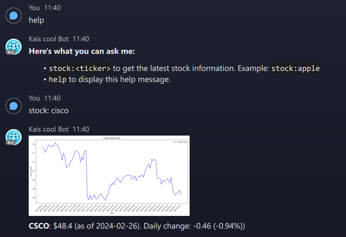
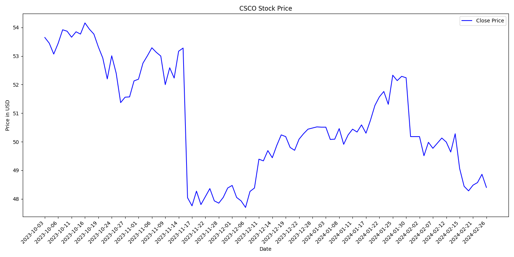

# Webex Kais Cool Bot Documentation

## Introduction

The Webex Ngrok Bot is designed to automate the process of setting up Ngrok webhooks and responding to stock information and graphics directly in Webex Teams. It utilizes APIs to fetch real-time stock data and generate course charts, enhancing team communication with up-to-date financial insights.

### Bot in action


## Setup Guide

### Prerequisites

- Python 3.x
- Flask
- Ngrok account and setup
- Cloudinary account for image hosting
- Webex Teams account and bot setup

### Environment Setup

1. **Clone Repository**: Clone this repository to your local machine or the server where you intend to run the bot.
2. **Install Dependencies**: Install the required Python packages using pip:
   ```sh
   pip install Flask webexteamssdk requests matplotlib cloudinary
   ```
3. **Configure Environment Variables**: Set up the necessary environment variables or directly insert your tokens and keys into the script (not recommended for production):
   - `MY_BOT_TOKEN`: Your Webex Teams bot token.
   - Cloudinary credentials: Set up in the script or as environment variables for `cloud_name`, `api_key`, and `api_secret`.

### Ngrok Setup

1. Start Ngrok on the same machine running the bot and forward it to the port defined in the bot script (default 4111):
   ```sh
   ngrok http 4111
   ```
2. Note down the HTTPS URL provided by Ngrok; this will be used for setting up the Webex Teams webhook.

## Usage

Once setup is complete and the bot is running, you can interact with it directly through Webex Teams.

### Available Commands

- **Stock Information**: Send a message in the format `stock:<Ticker>`, e.g., `stock:AAPL`, to receive the latest stock information and a chart depicting recent price movements.
- **Help**: Type `help` to get a list of available commands and instructions for use.

## How It Works

### Flask Web Server

A Flask web server listens for incoming webhook notifications from Webex Teams. When a new message is detected, the bot processes the message to determine if it contains a recognized command.

### Fetching Stock Information

The bot uses the Alpha Vantage API to search for stock symbols and retrieve daily stock data. This information is then formatted and sent back to the requesting user in Webex Teams. With a free API Key, the current limit is 25 stock requests per day. After that, the bot will be unable to find stocks.

### Chart Generation

For stock commands, the bot generates a chart depicting price movements using matplotlib. This chart is uploaded to Cloudinary, and a secure URL is sent along with the stock information to the user.

## Technical Details

- **check_ngrok()**: Checks if Ngrok is running and retrieves the public URL.
- **check_webhooks(ngrok_url)**: Ensures the Webex webhook is properly set up for the bot.
- **find_stock_symbol(query)**: Searches for a stock symbol based on a user query.
- **get_stock_info(symbol)**: Retrieves the latest stock information using the Alpha Vantage API.
- **generate_stock_graph(symbol)**: Generates and uploads a stock price chart to Cloudinary.

## Contributing

Contributions to the bot are welcome! Please feel free to fork the repository, make your changes, and submit a pull request.

## License

Specify your license here or indicate if the project is open-source and freely available for modification and use.
